# Campanha Sorte de Quem Indica
## Sistema de Análise de Cupom Fiscal

---

## 📊 Resultados até 18/11/2025

- **Total de Cupons Analisados:** 132.354
- **Valor em Produtos SpecialDog:** R$ 14.936.852,30

---

## 🎯 REGRAS DE PONTUAÇÃO DA CAMPANHA

### Tabela de Multiplicadores

| Linha do Produto | Multiplicador | Exemplo (10 unidades) |
|------------------|---------------|----------------------|
| 🔴 **PREMIUM** (Padrão) | **1x** | 10 × 1 = **10 pontos** |
| 🟡 **ULTRALIFE** | **2x** | 10 × 2 = **20 pontos** |
| 🟢 **BIONATURAL** | **3x** | 10 × 3 = **30 pontos** |
| 🔵 **BIONATURAL SENSITIVE** | **4x** | 10 × 4 = **40 pontos** |

**Fórmula:** `PONTOS = QUANTIDADE × MULTIPLICADOR`

---

## 🏗️ Stack Tecnológica

| Tecnologia | Finalidade |
|------------|-----------|
| **ASP.NET** | Backend e API principal |
| **OpenCvSharp** | Processamento e tratamento de imagens |
| **Google Cloud Vision OCR** | OCR primário (prioridade 1) |
| **AWS OCR** | OCR secundário (fallback) |
| **Google Document AI OCR** | OCR terciário (fallback) |
| **OpenAI API Assistant** | Conversão para JSON e validação de produtos |
| **Hangfire** | Orquestração dos robôs e agentes |

---

## 🔄 Fluxo Geral do Sistema

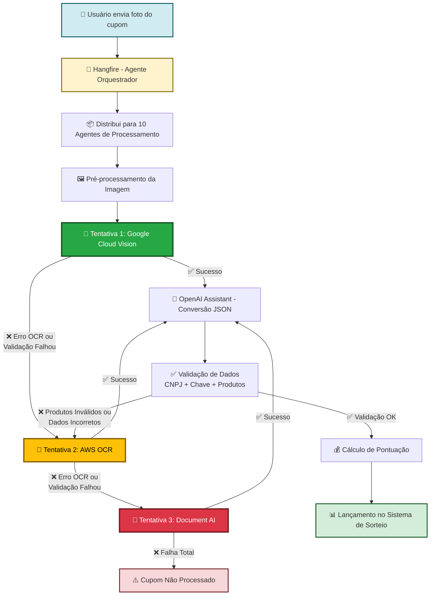

### 🔄 Estratégia de Retry com 3 OCRs

**IMPORTANTE:** O sistema tenta os 3 OCRs em sequência quando encontra:
- ❌ Erro na leitura do OCR
- ❌ Texto extraído incompleto ou ilegível
- ❌ Produtos não identificados
- ❌ CNPJ ou Chave inválidos
- ❌ Falha na conversão JSON
- ❌ Validação de dados falhou

**Fluxo de Retry:**
```
1ª Tentativa → Google Cloud Vision
    ↓ (erro em qualquer etapa)
2ª Tentativa → AWS OCR (processa do zero)
    ↓ (erro em qualquer etapa)
3ª Tentativa → Document AI (processa do zero)
    ↓ (erro em qualquer etapa)
❌ Cupom marcado como não processado
```

---

## 🎯 Arquitetura de Agentes

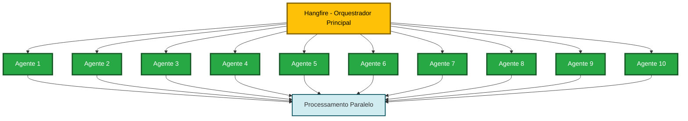

**Função dos Agentes:**
- ⚡ **10 agentes** trabalhando em paralelo
- 📦 **Cada agente** processa cupons de forma independente
- 🔄 **Distribuição automática** de carga pelo Hangfire
- 📊 **Processamento escalável** - pode aumentar número de agentes conforme demanda

---

## 🖼️ Etapa 1: Pré-processamento de Imagem

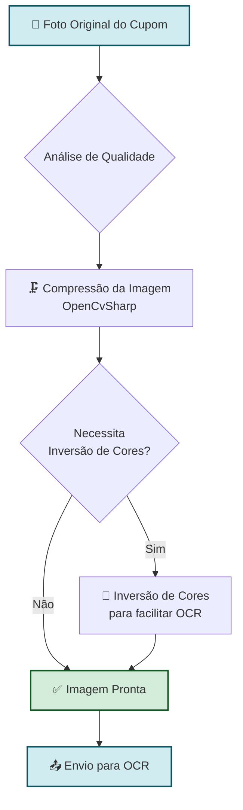

**Objetivos do Pré-processamento:**
- 🗜️ Reduzir tamanho do arquivo mantendo qualidade
- 🔍 Melhorar contraste para leitura do OCR
- 💰 Otimizar custos de processamento
- ⚡ Aumentar taxa de sucesso do OCR

---

## 📝 Etapa 2: OCR em Cascata com Retry Completo

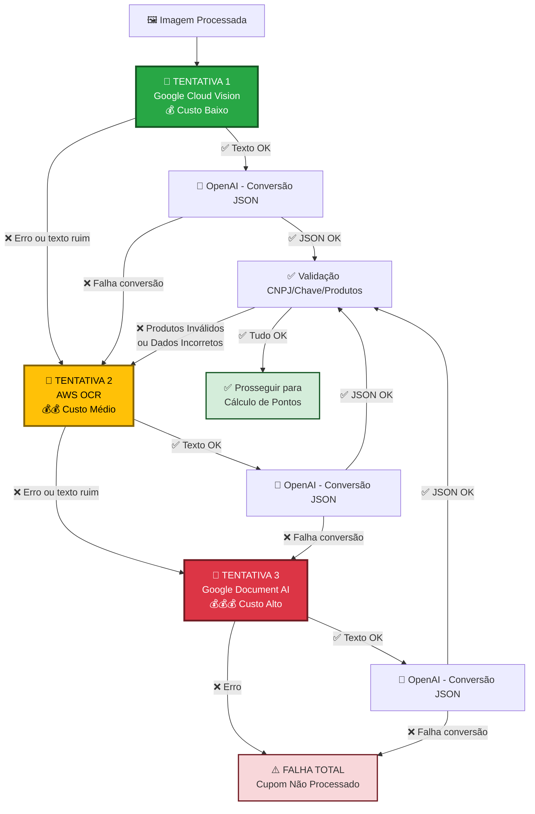

### 🔄 Sistema de Retry Inteligente

**O sistema SEMPRE tenta os 3 OCRs quando encontra:**

| Tipo de Erro | Causa o Retry? | Próximo OCR |
|--------------|----------------|-------------|
| ❌ OCR não conseguiu ler | ✅ Sim | Próximo da fila |
| ❌ Texto extraído ilegível | ✅ Sim | Próximo da fila |
| ❌ OpenAI falhou converter JSON | ✅ Sim | Próximo da fila |
| ❌ CNPJ inválido no JSON | ✅ Sim | Próximo da fila |
| ❌ Chave NF-e inválida | ✅ Sim | Próximo da fila |
| ❌ Nenhum produto válido encontrado | ✅ Sim | Próximo da fila |
| ❌ Produtos não reconhecidos | ✅ Sim | Próximo da fila |
| ❌ JSON malformado | ✅ Sim | Próximo da fila |

### 📊 Estratégia de Fallback

| Tentativa | OCR | Custo | Quando Usa | Taxa Sucesso Final |
|-----------|-----|-------|------------|-------------------|
| **1ª** | Google Cloud Vision | 💰 Baixo | Sempre | ~85% |
| **2ª** | AWS OCR | 💰💰 Médio | Se 1ª falhar em qualquer etapa | ~12% |
| **3ª** | Google Document AI | 💰💰💰 Alto | Se 2ª falhar em qualquer etapa | ~3% |

**Taxa de Sucesso Acumulada:** ~98% (após 3 tentativas)

### 💡 Exemplo de Fluxo Real

```
┌─────────────────────────────────────────────────────────┐
│ CUPOM #12345 - Tentando processar                      │
├─────────────────────────────────────────────────────────┤
│                                                         │
│ 1ª TENTATIVA: Google Cloud Vision                      │
│   ├─ OCR extraiu texto: ✅ OK                          │
│   ├─ OpenAI converteu JSON: ✅ OK                      │
│   └─ Validação CNPJ: ❌ CNPJ inválido detectado       │
│                                                         │
│ 🔄 RETRYING COM 2º OCR...                              │
│                                                         │
│ 2ª TENTATIVA: AWS OCR                                  │
│   ├─ OCR extraiu texto: ✅ OK (melhor qualidade)      │
│   ├─ OpenAI converteu JSON: ✅ OK                      │
│   ├─ Validação CNPJ: ✅ OK                             │
│   ├─ Validação Chave: ✅ OK                            │
│   └─ Validação Produtos: ✅ 3 produtos elegíveis      │
│                                                         │
│ ✅ CUPOM APROVADO - 28 pontos gerados                  │
└─────────────────────────────────────────────────────────┘
```

**Vantagens de Cada OCR:**
- **Google Cloud Vision:** Rápido, econômico, ótimo para cupons limpos
- **AWS:** Melhor com textos complexos, cupons amassados, múltiplas fontes
- **Document AI:** Máxima precisão, entende layouts complexos, reconhece tabelas e estruturas

---

## 🤖 Etapa 3: Conversão para JSON com OpenAI

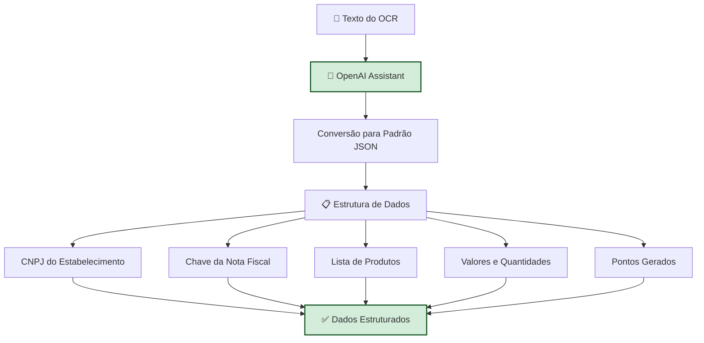

### 📋 Estrutura JSON Gerada

```json
{
  "Cnpj": "XXXXXXXX",
  "Chave": "3525110330XXX00011765001XXXXXX1000261605",
  "Url": "https://www.nfce.fazenda.sp.gov.br/consulta?p=...",
  "DataEmissao": "2025-11-08T11:40:18",
  "ValorTotalCupom": 141.7,
  "Produtos": [
    {
      "Nome": "SACHE DOG CHOW FL. CARNE 100GR",
      "Quantidade": 4.0,
      "ValorUnitario": 3.5,
      "ValorTotal": 14.0,
      "DescontoUnitario": 0.0,
      "DescontoTotal": 0.0,
      "ValorUnitarioMenosDesconto": 3.5,
      "ValorTotalMenosDesconto": 14.0,
      "PontosGerados": 4.0,
      "Duvida": false,
      "ProdutoSpecialDog": false
    },
    {
      "Nome": "SPECIAL DOG ULTRALIFE CORDEIRO 100GR",
      "Quantidade": 4.0,
      "ValorUnitario": 3.2,
      "ValorTotal": 12.8,
      "DescontoUnitario": 0.0,
      "DescontoTotal": 0.0,
      "ValorUnitarioMenosDesconto": 3.2,
      "ValorTotalMenosDesconto": 12.8,
      "PontosGerados": 8.0,
      "Duvida": false,
      "ProdutoSpecialDog": true
    }
  ],
  "TextoCompleto": "TEXTO COMPLETO EXTRAÍDO DO OCR..."
}
```

### 📋 Detalhamento dos Campos JSON

#### **Campos do Cupom**
| Campo | Tipo | Descrição |
|-------|------|-----------|
| `Cnpj` | string | CNPJ do estabelecimento (apenas números) |
| `Chave` | string | Chave de acesso da NFC-e (44 dígitos) |
| `Url` | string | URL para consulta da nota fiscal |
| `DataEmissao` | datetime | Data e hora de emissão do cupom |
| `ValorTotalCupom` | decimal | Valor total do cupom fiscal |
| `Produtos` | array | Lista de produtos identificados no cupom |
| `TextoCompleto` | string | Texto bruto extraído pelo OCR |

#### **Campos de Cada Produto**
| Campo | Tipo | Descrição |
|-------|------|-----------|
| `Nome` | string | Descrição do produto conforme cupom |
| `Quantidade` | decimal | Quantidade comprada |
| `ValorUnitario` | decimal | Valor unitário original |
| `ValorTotal` | decimal | Valor total do item (Qtd × Valor Unit.) |
| `DescontoUnitario` | decimal | Desconto aplicado por unidade |
| `DescontoTotal` | decimal | Desconto total no item |
| `ValorUnitarioMenosDesconto` | decimal | Valor unitário após desconto |
| `ValorTotalMenosDesconto` | decimal | Valor total após desconto |
| `PontosGerados` | decimal | **Pontos calculados para o produto** |
| `Duvida` | boolean | Flag indicando se há dúvida na identificação |
| `ProdutoSpecialDog` | boolean | **Indica se é produto elegível SpecialDog** |

---

## 🔍 Processamento Detalhado do JSON

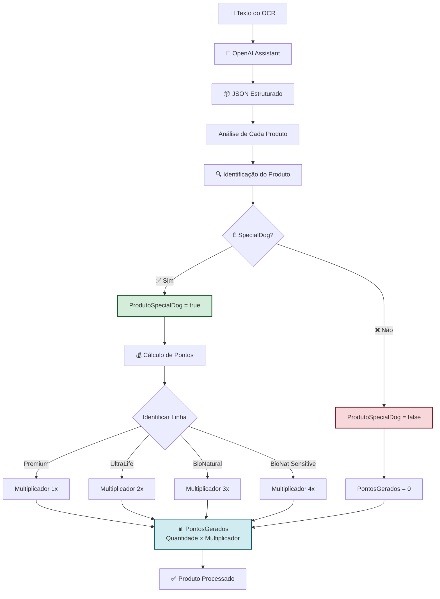

### 🎯 Regras de Negócio Aplicadas

#### **1. Identificação de Produtos SpecialDog**

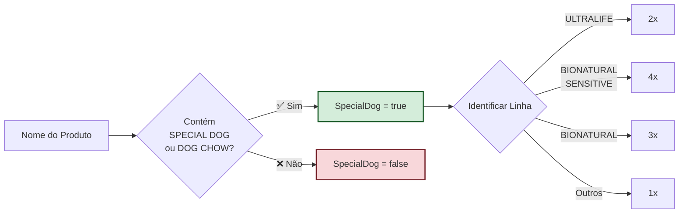

#### **2. Cálculo de Pontuação por Linha de Produto**

**Tabela de Identificação:**

| Palavras-chave no Nome | Linha | Multiplicador | Pontos p/ 10 unid. |
|------------------------|-------|---------------|--------------------|
| "PREMIUM", "SACHÊ", "CARNE" | Premium | 1x | 10 |
| "ULTRALIFE" | UltraLife | 2x | 20 |
| "BIONATURAL" (sem "SENSITIVE") | BioNatural | 3x | 30 |
| "BIONATURAL" + "SENSITIVE" | BioNat. Sensitive | 4x | 40 |
| Nenhuma das acima | Não elegível | 0x | 0 |

**Exemplos de Cálculo Real:**

| Exemplo | Produto | Qtd | Linha | Mult. | Cálculo | Pontos |
|---------|---------|-----|-------|-------|---------|--------|
| 1 | SPECIAL DOG SACHÊ CARNE 100G | 5 | Premium | 1x | 5 × 1 | **5** |
| 2 | SPECIAL DOG ULTRALIFE CORDEIRO | 5 | UltraLife | 2x | 5 × 2 | **10** |
| 3 | SPECIAL DOG BIONATURAL ADULTO | 5 | BioNatural | 3x | 5 × 3 | **15** |
| 4 | SPECIAL DOG BIONATURAL SENSITIVE | 5 | BioNat. Sensit. | 4x | 5 × 4 | **20** |

#### **3. Tratamento de Descontos**

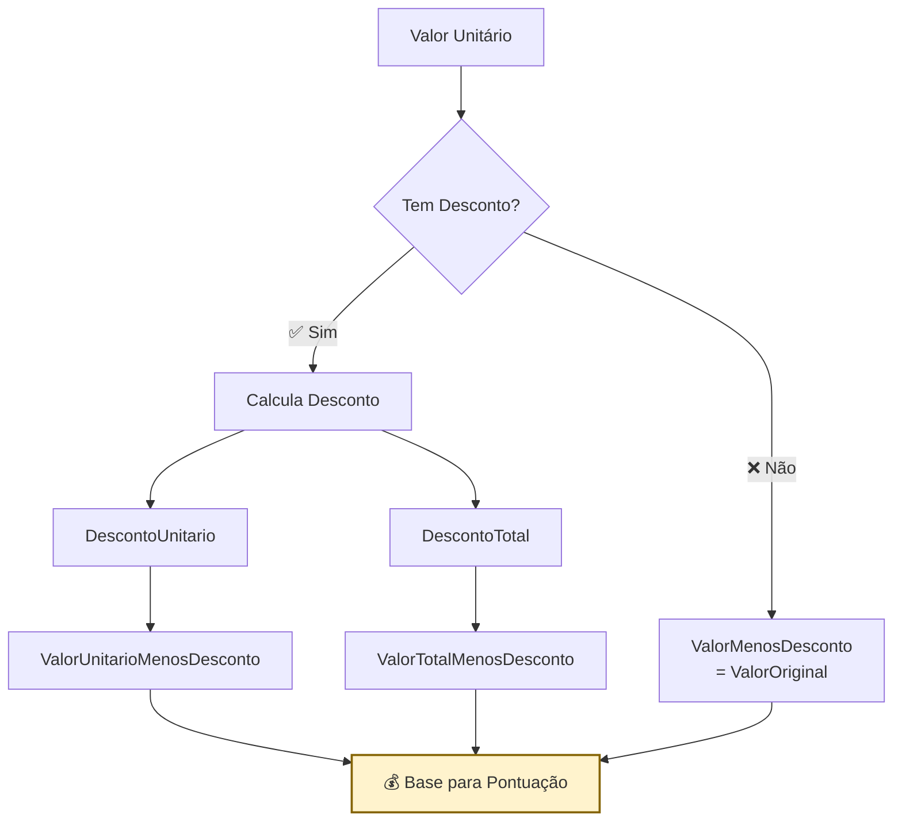

**IMPORTANTE:** Os pontos são calculados sempre sobre o valor APÓS descontos.

#### **4. Flag de Dúvida**

O campo `Duvida` é marcado como `true` quando:
- Nome do produto está incompleto ou truncado
- OCR teve baixa confiança na leitura
- Produto com nome ambíguo
- Necessita validação manual

```json
{
  "Nome": "SPECIAL DOG S...",
  "Duvida": true,
  "ProdutoSpecialDog": true
}
```

---

## 📊 Análise de Exemplo Real

### Cupom Processado

```json
{
  "Cnpj": "03302910000117",
  "Chave": "35251103302910000117650010000261591000261605",
  "DataEmissao": "2025-11-08T11:40:18",
  "ValorTotalCupom": 141.70
}
```

### Breakdown de Pontos (Exemplo Real)

| Produto | Qtd | Valor | Linha | Mult. | Pontos |
|---------|-----|-------|-------|-------|--------|
| SACHE DOG CHOW FL. CARNE | 4 | 14.00 | Premium | 1x | 4 |
| SACHE DOG CHOW AD. CARNE | 8 | 28.00 | Premium | 1x | 8 |
| SACHE DOG CHOW FL. CARNE | 8 | 28.00 | Premium | 1x | 8 |
| SPECIAL DOG ULTRALIFE CORDEIRO | 4 | 12.80 | UltraLife | 2x | 8 |
| AREIA PIPICAT FLORAL | 1 | 58.90 | N/A | 0x | 0 |
| **TOTAL** | **25** | **141.70** | - | - | **28** |

**Resumo da Pontuação:**
- ✅ 4 produtos SpecialDog elegíveis
- ❌ 1 produto não elegível (areia para gatos)
- 💰 **28 pontos** gerados no total
- 📊 58.5% do valor do cupom em produtos SpecialDog (R$ 82,80)

**Detalhamento por Linha:**
- 🔵 **Premium (1x):** 20 unidades = 20 pontos
- 🟢 **UltraLife (2x):** 4 unidades × 2 = 8 pontos
- ⚪ **Não elegível:** 0 pontos

---

## ✅ Etapa 4: Validação de Dados

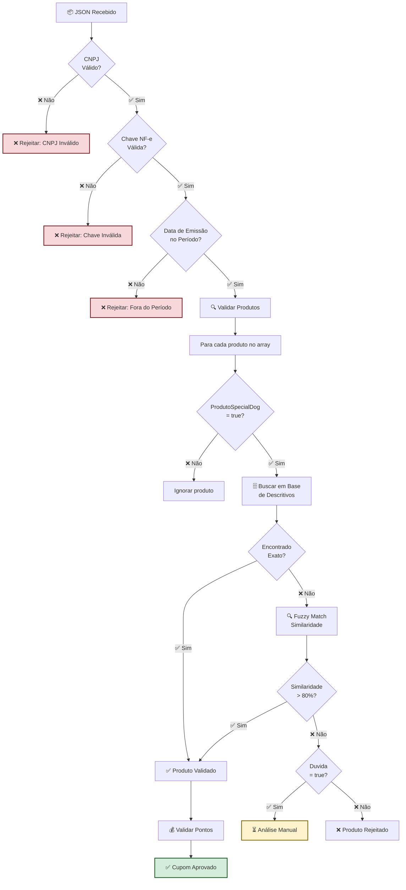

### 🗄️ Base de Descritivos de Produtos

**Exemplos de Variações Cadastradas**

Produto Padrão: **SPECIAL DOG SACHÊ CARNE 100G**

| Variação Encontrada no Cupom | Logista | Status |
|------------------------------|---------|--------|
| SACHE SPECIAL DOG CARNE 100GR | Rede A | ✅ Mapeado |
| SP DOG SACHE CARNE 100G | Rede B | ✅ Mapeado |
| SPECIAL DOG ADULTO CARNE SACHE | Rede C | ✅ Mapeado |
| SPL DOG SACHE CRN 100 | Rede D | ✅ Mapeado |
| SPECIALDOG SACHET BEEF 100G | Rede E | ✅ Mapeado |

**Processo de Cadastro:**
1. 📝 Equipe identifica novas variações de nome
2. ✍️ Cadastro manual no sistema
3. 🔗 Vinculação ao produto padrão
4. ✅ Validação e ativação

### Algoritmo de Fuzzy Match

```python
def validar_produto(nome_cupom, base_descritivos):
    # 1. Normalização do texto
    nome_normalizado = normalize(nome_cupom)
    # Remove acentos, converte para maiúsculas, 
    # remove caracteres especiais
    
    # 2. Busca exata
    if nome_normalizado in base_descritivos:
        return True, 100  # Match exato
    
    # 3. Fuzzy matching (Levenshtein Distance)
    for descritivo in base_descritivos:
        similaridade = calcular_similaridade(
            nome_normalizado, 
            descritivo
        )
        
        if similaridade >= 80:  # Threshold de 80%
            return True, similaridade
    
    # 4. Não encontrado
    return False, 0
```

**Técnicas Utilizadas:**
- **Levenshtein Distance:** Mede diferença entre strings
- **Jaro-Winkler:** Otimizado para nomes curtos
- **Token Sort Ratio:** Ignora ordem das palavras

**Exemplo de Similaridade:**

| Texto Cupom | Produto Base | Similaridade | Match? |
|-------------|--------------|--------------|--------|
| "SACHE SPECIAL DOG" | "SPECIAL DOG SACHÊ" | 92% | ✅ |
| "SP DOG CARNE" | "SPECIAL DOG CARNE" | 87% | ✅ |
| "SPECIAL CAT" | "SPECIAL DOG" | 45% | ❌ |
| "SPECIALDOG ADULTO" | "SPECIAL DOG ADULTO" | 95% | ✅ |

---

## 💰 Etapa 5: Cálculo de Pontuação

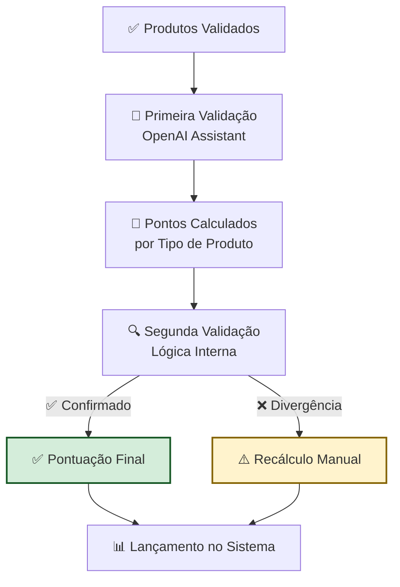

### 🔄 Processo de Validação Dupla

**Otimização de Custos Implementada:**

| Versão | Método | Custo Tokens | Status |
|--------|--------|--------------|--------|
| **1.0** (Antiga) | OpenAI calcula tudo | 💰💰💰 Alto | ❌ Descontinuada |
| **2.0** (Atual) | OpenAI + Lógica | 💰 Médio | ✅ Em Produção |

**Fluxo Atual:**
1. 🤖 **OpenAI Assistant** faz cálculo inicial baseado nas regras
2. ✅ **Lógica Interna** valida o cálculo da IA
3. ⚖️ Se houver divergência → Recálculo ou análise manual
4. 💰 **Economia:** ~60% de redução no consumo de tokens

---

## 📊 Etapa 6: Lançamento Final

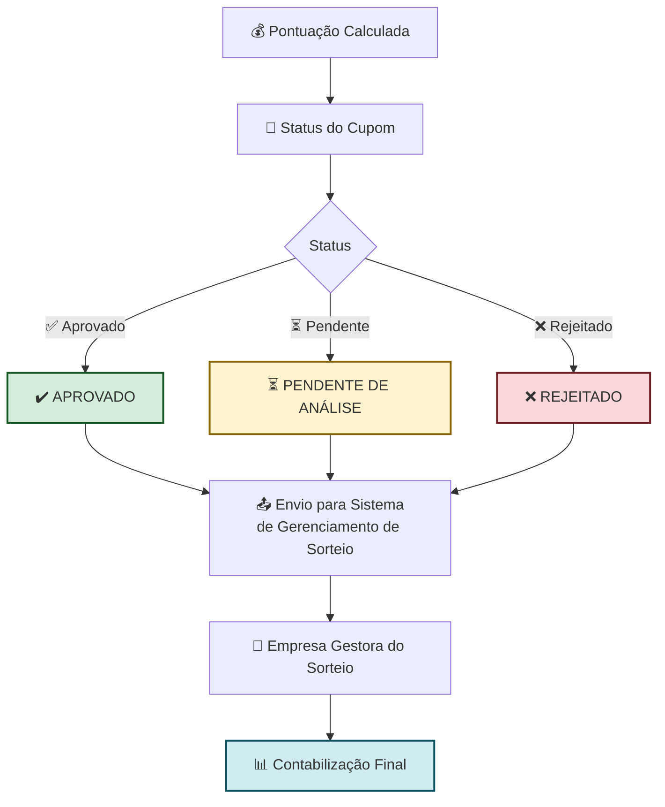

**Possíveis Status:**
- ✅ **APROVADO:** Cupom validado, produtos elegíveis, pontos calculados
- ⏳ **PENDENTE:** Aguardando análise manual (flag `Duvida = true`)
- ❌ **REJEITADO:** CNPJ inválido, chave inválida, sem produtos elegíveis, fora do período

---

## 🔁 Fluxo Completo Integrado com Sistema de Retry

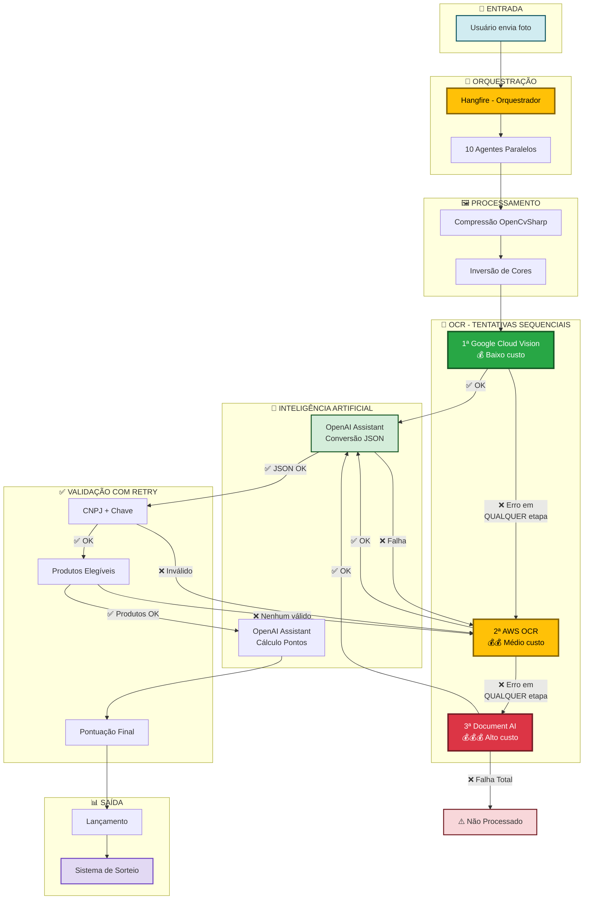

### 🔄 Pontos de Retry no Sistema

O sistema tenta os **3 OCRs em sequência** quando detecta erro em:

1. **Leitura do OCR**
   - Texto ilegível ou incompleto
   - Imagem de baixa qualidade
   - Caracteres não reconhecidos

2. **Conversão JSON (OpenAI)**
   - Falha ao estruturar dados
   - JSON malformado
   - Campos essenciais ausentes

3. **Validação de CNPJ/Chave**
   - CNPJ com dígitos incorretos
   - Chave NF-e inválida
   - Formato incorreto

4. **Validação de Produtos**
   - Nenhum produto SpecialDog encontrado
   - Produtos não reconhecidos
   - Descrições muito curtas/truncadas

5. **Cálculo de Pontos**
   - Valores inconsistentes
   - Multiplicadores incorretos
   - Quantidades inválidas

### 📊 Taxa de Sucesso por Tentativa

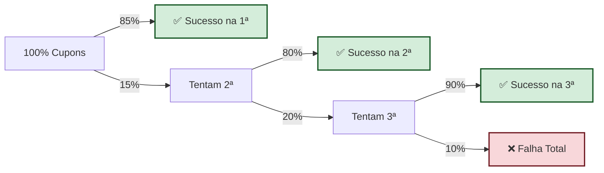

**Resultado Final:** ~98% de taxa de sucesso após as 3 tentativas

---

## 🔄 Sistema de Retry Inteligente

### Como Funciona o Retry

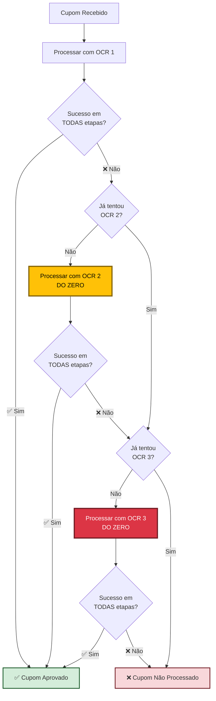

### 📋 Checklist de Validação (Cada Tentativa)

Para um cupom ser considerado **SUCESSO**, ele precisa passar por TODAS as etapas:

| # | Etapa | Validação | Se Falhar |
|---|-------|-----------|-----------|
| 1 | OCR | Texto legível extraído | ❌ Tenta próximo OCR |
| 2 | OpenAI | JSON estruturado criado | ❌ Tenta próximo OCR |
| 3 | CNPJ | Formato válido e dígitos OK | ❌ Tenta próximo OCR |
| 4 | Chave NF-e | 44 dígitos válidos | ❌ Tenta próximo OCR |
| 5 | Data | Dentro do período da campanha | ❌ Tenta próximo OCR |
| 6 | Produtos | Pelo menos 1 produto elegível | ❌ Tenta próximo OCR |
| 7 | Pontos | Cálculo validado | ❌ Tenta próximo OCR |

**Se QUALQUER uma falhar** → Sistema tenta o próximo OCR

### 💡 Exemplo Real de Retry

```
┌──────────────────────────────────────────────────────────────┐
│ CUPOM #45678 - Foto com baixa qualidade                     │
├──────────────────────────────────────────────────────────────┤
│                                                              │
│ 🔵 TENTATIVA 1: Google Cloud Vision                         │
│    ├─ OCR: ✅ Extraiu texto                                 │
│    ├─ OpenAI: ✅ JSON criado                                │
│    ├─ CNPJ: ✅ 12345678000190                               │
│    ├─ Chave: ❌ Apenas 40 dígitos (faltam 4)               │
│    └─ 🔄 RETRYING...                                        │
│                                                              │
│ 🟡 TENTATIVA 2: AWS OCR                                     │
│    ├─ OCR: ✅ Extraiu texto (melhor qualidade)             │
│    ├─ OpenAI: ✅ JSON criado                                │
│    ├─ CNPJ: ✅ 12345678000190                               │
│    ├─ Chave: ✅ 12345678901234567890123456789012345678901234│
│    ├─ Produtos: ❌ Nenhum produto elegível encontrado      │
│    └─ 🔄 RETRYING...                                        │
│                                                              │
│ 🔴 TENTATIVA 3: Google Document AI                          │
│    ├─ OCR: ✅ Extraiu texto (máxima qualidade)             │
│    ├─ OpenAI: ✅ JSON criado                                │
│    ├─ CNPJ: ✅ 12345678000190                               │
│    ├─ Chave: ✅ 12345678901234567890123456789012345678901234│
│    ├─ Produtos: ✅ 3 produtos SpecialDog encontrados       │
│    ├─ Pontos: ✅ 42 pontos calculados                       │
│    └─ ✅ CUPOM APROVADO!                                    │
│                                                              │
└──────────────────────────────────────────────────────────────┘
```

### 🎯 Por Que Cada OCR Pode Ter Resultado Diferente?

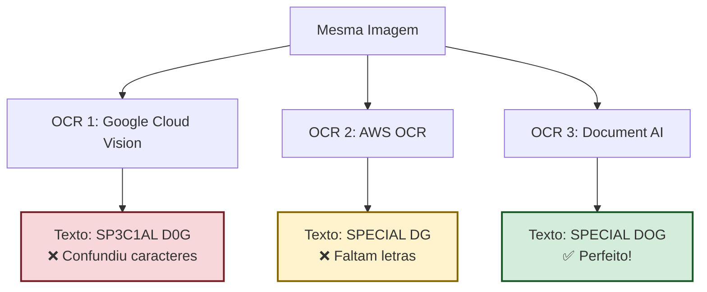

**Motivos das diferenças:**
- 🔍 **Algoritmos diferentes** de reconhecimento
- 📊 **Modelos de IA** treinados com datasets distintos
- 🎯 **Especialização:** cada OCR é melhor em cenários específicos
- 💰 **Custo vs Qualidade:** os mais caros têm melhor precisão

### 📊 Estatísticas do Sistema de Retry

| Métrica | Valor |
|---------|-------|
| Cupons que passam na 1ª tentativa | 85% |
| Cupons que passam na 2ª tentativa | 12% |
| Cupons que passam na 3ª tentativa | 3% |
| **Taxa de sucesso total** | **~98%** |
| Taxa de falha total | ~2% |

### ⚙️ Configurações do Sistema

```json
{
  "retry_config": {
    "max_tentativas": 3,
    "timeout_por_ocr": "30s",
    "backoff_strategy": "nenhum (sequencial)",
    "ocr_sequence": [
      "GoogleCloudVision",
      "AWS_Textract", 
      "GoogleDocumentAI"
    ],
    "validacoes_obrigatorias": [
      "cnpj_valido",
      "chave_nfe_valida",
      "data_no_periodo",
      "pelo_menos_um_produto_elegivel"
    ]
  }
}
```

---

## 🎯 Diferenciais do Sistema

### ⚡ Performance
- **10 agentes paralelos** processando simultaneamente
- **Orquestração com Hangfire** para distribuição eficiente
- Processamento médio de milhares de cupons por dia
- **Tempo médio:** < 30 segundos por cupom

### 🛡️ Confiabilidade
- **3 camadas de OCR** com fallback automático
- **Validação dupla** de pontuação (IA + Lógica)
- Sistema de retry automático em caso de falhas
- **Taxa de sucesso:** ~98% com 3 camadas

### 💰 Otimização de Custos
- Priorização de OCR mais econômico (Google Cloud Vision)
- Redução de uso de tokens OpenAI (cálculo híbrido)
- Compressão inteligente de imagens
- **Economia:** 60% em tokens vs versão 1.0

### 🎯 Precisão
- **Base de descritivos cadastrada manualmente**
- Lógica de similaridade para variações de nome (>80%)
- Validação CNPJ e chave de nota fiscal
- Double-check em pontuações

---

## 📈 Métricas de Sucesso

| Métrica | Valor |
|---------|-------|
| **Cupons Processados** | 132.354 |
| **Valor Total em Produtos** | R$ 14.936.852,30 |
| **Média por Cupom** | R$ 112,86 |
| **Taxa de Sucesso OCR** | ~98% (com 3 camadas) |
| **Tempo Médio** | < 30 segundos |
| **Economia de Tokens** | 60% vs v1.0 |

### 📊 Distribuição de Uso de OCR

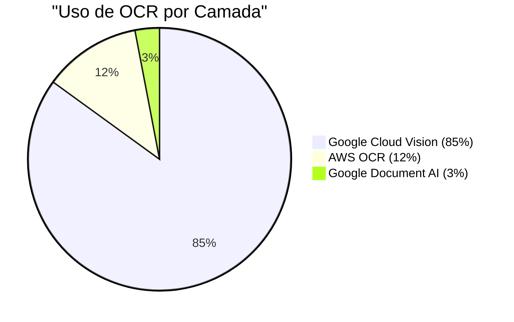

---

## 🔮 Evolução do Sistema

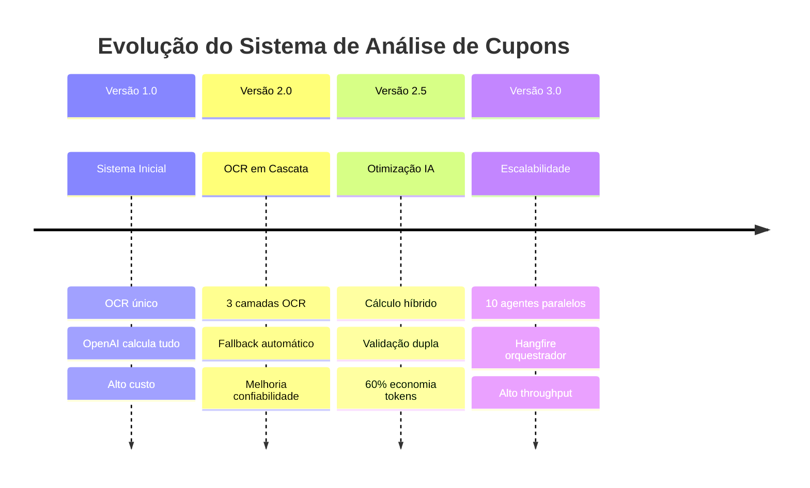

### Versão 1.0 (Inicial)
- ❌ OpenAI calculava toda pontuação
- ❌ Alto custo com tokens
- ❌ OCR único
- ❌ Sem processamento paralelo

### Versão 2.0 (Atual)
- ✅ Cálculo híbrido (IA + Lógica)
- ✅ Economia de tokens significativa
- ✅ 3 camadas de OCR
- ✅ 10 agentes paralelos
- ✅ Validação dupla de pontos
- ✅ Base de descritivos expandida

---

## 🛠️ Manutenção e Monitoramento

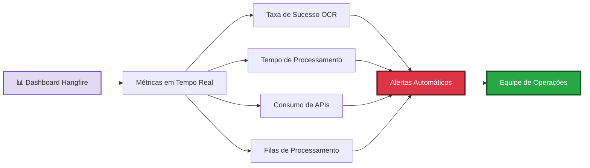

**Pontos Monitorados:**
- 📊 Taxa de sucesso por camada de OCR
- ⏱️ Tempo de processamento por agente
- 💰 Consumo de tokens OpenAI
- ⚠️ Erros e exceções
- 📈 Filas de processamento
- 🔍 Cupons em análise manual

**Alertas Configurados:**
- 🚨 Taxa de erro > 5%
- 🚨 Tempo de processamento > 60s
- 🚨 Fila com mais de 100 cupons
- 🚨 Consumo de API acima do esperado

---

## 🎓 Conclusão

O sistema de análise de cupom fiscal da campanha **Sorte de Quem Indica** representa uma solução robusta e escalável que combina:

✅ **Múltiplas tecnologias de OCR** para máxima confiabilidade (98% taxa de sucesso)  
✅ **Inteligência Artificial** para extração e validação de dados  
✅ **Processamento paralelo** com 10 agentes para alta performance  
✅ **Otimização de custos** através de estratégias inteligentes (60% economia)  
✅ **Validação rigorosa** para garantir precisão nos resultados  
✅ **Regras de pontuação flexíveis** (1x, 2x, 3x, 4x) por linha de produto

### 🎯 Impacto da Campanha

**Resultado:** Mais de **132 mil cupons** processados com sucesso, representando quase **R$ 15 milhões** em produtos SpecialDog, com um sistema eficiente, confiável e escalável!


---

*Documento gerado em: 18/11/2025*  
*Sistema: Campanha Sorte de Quem Indica*  
*Versão: 3.0*
